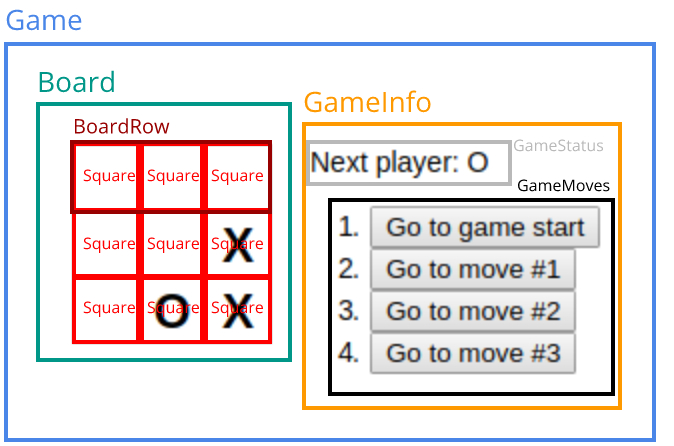

# Intro To React: Tic Tac Toe Official Tutorial
My components refactoring of Reactjs [official tic-tac-toe tutorial][1]

[1]: https://reactjs.org/tutorial/tutorial.html

## Components Scheme

## Important notes

* Data flow 
  > When you want to **aggregate** data from multiple children or to have two child components **communicate with each other**, move the state **upwards** so that it lives in the parent component. The **parent** can then **pass the state back down to the children via props**, so that the child components are always **in sync with each other and with the parent**.

* [Immutability](https://reactjs.org/tutorial/tutorial.html#why-immutability-is-important)
  * [Easier Undo/Redo and Time Travel](https://reactjs.org/tutorial/tutorial.html#easier-undoredo-and-time-travel)
  * [Tracking Changes](https://reactjs.org/tutorial/tutorial.html#tracking-changes)
  * [Determining When to Re-render in React](https://reactjs.org/tutorial/tutorial.html#determining-when-to-re-render-in-react)

* [Keys](https://reactjs.org/tutorial/tutorial.html#keys)
  > When you render a list of items, React always stores some info about each item in the list. If you render a component that has state, that state needs to be stored – and regardless of how you implement your components, React stores a reference to the backing native views.

  > When you update that list, React needs to determine what has changed. You could’ve added, removed, rearranged, or updated items in the list.

  > It’s strongly recommended that you assign proper keys whenever you build dynamic lists. If you don’t have an appropriate key handy, you may want to consider restructuring your data so that you do.

  > Explicitly passing `key={i}` silences the warning but has the same problem so isn’t recommended in most cases.